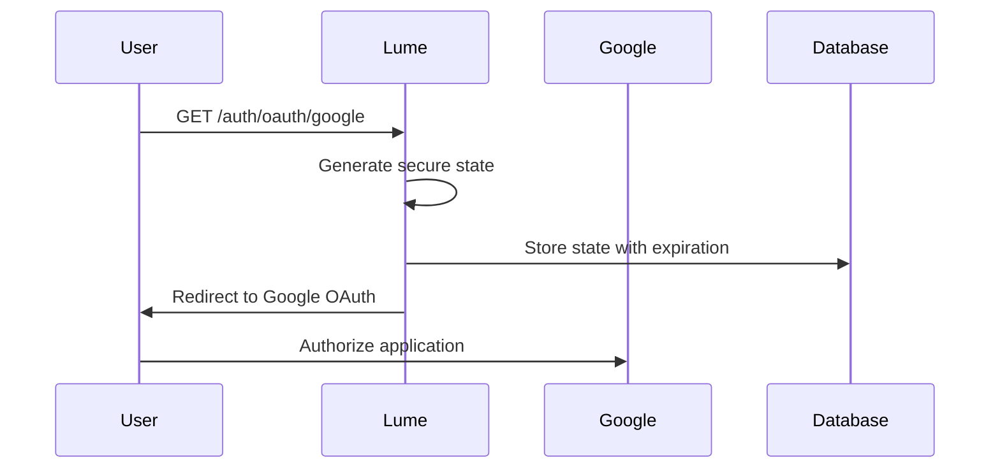
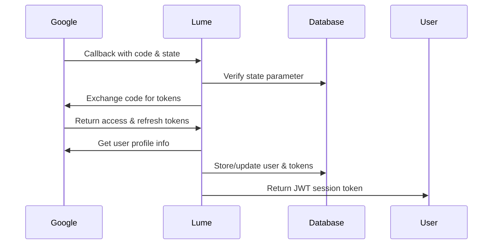

# LUME - AI Productivity Assistant

<div align="center">
  <h1>🌟 L U M E 🌟</h1>
  <p><strong>Your Intelligent Google Services Assistant</strong></p>
</div>

A comprehensive full-stack AI-powered productivity agent with Google services integration, featuring a Django REST backend and a beautiful Next.js frontend with Google-themed UI.

## 🎯 Features

- 🔐 **Two-Stage OAuth 2.0** - Smart permission requesting based on user needs
- 📧 **Gmail Integration** - Send, read, and manage emails
- 📅 **Google Calendar** - Create and manage calendar events
- ✅ **Google Tasks** - Task tracking and management
- 📝 **Google Keep** - Note-taking and organization
- 💬 **Chat Interface** - Beautiful, intuitive conversation UI
- 🤖 **Service Detection** - Intelligent detection of required services
- 🗄️ **MySQL Database** - Persistent storage for users and conversations
- 📱 **Responsive Design** - Works on all devices

## 🏗️ Architecture

```
LUME/
├── lume_django/          # Django REST Backend
│   ├── oauth/           # OAuth app with two-stage permissions
│   ├── service_detector/ # Google services intent detection
│   └── lume_django/     # Django settings
└── lume_frontend/        # Next.js Frontend
    ├── src/
    │   ├── app/         # Next.js 14 app router
    │   ├── components/  # React components
    │   └── lib/         # API client
    └── public/          # Static assets
```

## 🚀 Quick Start

### Prerequisites

- Python 3.10+
- Node.js 18+
- MySQL 8.0+
- Google Cloud Console account

### 1️⃣ Database Setup

Create MySQL database:
```sql
CREATE DATABASE gmail_agent CHARACTER SET utf8mb4 COLLATE utf8mb4_unicode_ci;
```

### 2️⃣ Google Cloud Console Setup

1. Go to [Google Cloud Console](https://console.cloud.google.com/)
2. Create a new project or select existing one
3. Enable the following APIs:
   - Gmail API
   - Google Calendar API
   - Google Tasks API
   - Google Keep API (if available)
   - People API
4. Create OAuth 2.0 credentials:
   - Application type: Web application
   - Authorized redirect URIs:
     - `http://localhost:8000/oauth/callback/`
     - `http://localhost:8000/oauth/service-callback/`
5. Download credentials (you'll need Client ID and Client Secret)

### 3️⃣ Backend Setup (Django)

```bash
cd lume_django

# Create virtual environment (Windows)
python -m venv venv
venv\Scripts\activate

# Install dependencies
pip install -r requirements.txt

# Create .env file (use .env.example as template)
copy .env.example .env

# Edit .env with your credentials
# DB_NAME=gmail_agent
# DB_USER=root
# DB_PASSWORD=Kaustubh@149
# DB_HOST=127.0.0.1
# DB_PORT=3306
# GOOGLE_CLIENT_ID=your_client_id
# GOOGLE_CLIENT_SECRET=your_client_secret

# Run migrations
python manage.py makemigrations
python manage.py migrate

# Create superuser
python manage.py createsuperuser

# Run development server
python manage.py runserver
```

Backend will be available at `http://localhost:8000`

### 4️⃣ Frontend Setup (Next.js)

```bash
cd lume_frontend

# Install dependencies
npm install

# Environment is already configured in .env.local
# NEXT_PUBLIC_API_URL=http://localhost:8000

# Run development server
npm run dev
```

Frontend will be available at `http://localhost:3000`

### 5️⃣ Access the Application

1. Open browser to `http://localhost:3000`
2. Click "Sign in with Google"
3. Grant base permissions (email, profile, contacts)
4. Start chatting with LUME!
5. Additional service permissions will be requested as needed

## Google OAuth Flow Documentation

### Overview

The Lume agent uses Google OAuth 2.0 with the Authorization Code flow to securely access Google services on behalf of users. This implementation follows security best practices and handles token refresh automatically.

### OAuth Flow Steps

#### 1. **Initiate Authentication** (`GET /auth/oauth/google`)



**What happens:**
- Generates a secure random `state` parameter for CSRF protection
- Stores the state in database with 10-minute expiration
- Redirects user to Google's OAuth consent screen with required scopes

**Scopes requested:**
- `openid`, `email`, `profile` - Basic user information
- `gmail.readonly`, `gmail.send`, `gmail.modify` - Gmail access
- `calendar`, `calendar.events` - Calendar management
- `tasks` - Google Tasks access
- `keep.readonly` - Google Keep notes access
- `maps-platform.places` - Google Maps integration

#### 2. **Handle Callback** (`GET /auth/oauth/google/callback`)



**What happens:**
- Verifies the `state` parameter to prevent CSRF attacks
- Exchanges authorization code for access and refresh tokens
- Retrieves user profile information from Google
- Stores tokens securely in MySQL database
- Returns a JWT token for session management

#### 3. **Token Management**

**Access Token Storage:**
- Encrypted and stored in MySQL database
- Linked to user session
- Automatically refreshed when expired

**Refresh Token Handling:**
- Stored securely for long-term access
- Used to obtain new access tokens without re-authentication
- Requested with `access_type=offline` and `prompt=consent`

### API Endpoints

#### Authentication Endpoints

| Endpoint | Method | Description |
|----------|--------|-------------|
| `/auth/oauth/google` | GET | Initiate Google OAuth flow |
| `/auth/oauth/google/callback` | GET | Handle OAuth callback |
| `/auth/me` | GET | Get current user info |
| `/auth/refresh` | POST | Refresh Google access token |

#### Utility Endpoints

| Endpoint | Method | Description |
|----------|--------|-------------|
| `/health` | GET | Health check |

### Using Tokens in API Calls

After successful authentication, the stored Google access tokens can be used to make API calls to Google services:

```python
# Example: Making authenticated Gmail API call
async def get_gmail_messages(user: User):
    headers = {"Authorization": f"Bearer {user.access_token}"}
    
    async with httpx.AsyncClient() as client:
        response = await client.get(
            "https://gmail.googleapis.com/gmail/v1/users/me/messages",
            headers=headers
        )
        return response.json()
```

### Security Features

1. **CSRF Protection**: Uses secure random state parameters
2. **Token Encryption**: Sensitive tokens stored securely in database
3. **JWT Sessions**: Stateless session management with expiration
4. **Automatic Refresh**: Handles token refresh transparently
5. **Scope Validation**: Requests minimal necessary permissions
6. **State Expiration**: OAuth states expire after 10 minutes

### Database Schema

#### Users Table
```sql
CREATE TABLE users (
    id INT PRIMARY KEY AUTO_INCREMENT,
    google_id VARCHAR(255) UNIQUE,
    email VARCHAR(255) UNIQUE,
    name VARCHAR(255),
    access_token TEXT,
    refresh_token TEXT,
    token_expires_at DATETIME,
    created_at DATETIME DEFAULT CURRENT_TIMESTAMP,
    updated_at DATETIME DEFAULT CURRENT_TIMESTAMP ON UPDATE CURRENT_TIMESTAMP
);
```

#### OAuth States Table
```sql
CREATE TABLE oauth_states (
    id INT PRIMARY KEY AUTO_INCREMENT,
    state VARCHAR(255) UNIQUE,
    created_at DATETIME DEFAULT CURRENT_TIMESTAMP,
    expires_at DATETIME
);
```

### Error Handling

The implementation includes comprehensive error handling for:
- Invalid or expired state parameters
- Failed token exchanges
- Network errors during API calls
- Expired or invalid JWT tokens
- Database connection issues

### Next Steps

1. **Install Dependencies**: `pip install -r requirements.txt`
2. **Configure Environment**: Set up `.env` file with your credentials
3. **Setup Database**: Create MySQL database and run the application
4. **Test OAuth Flow**: Visit `/auth/oauth/google` to test authentication
5. **Integrate AI Features**: Add Gemini AI endpoints for productivity features

### Development

```bash
# Run with auto-reload for development
uvicorn main:app --reload --host 0.0.0.0 --port 8000

# Run tests
pytest

# Format code
black main.py

# Lint code
flake8 main.py
```

## API Documentation

Once the server is running, visit:
- **Interactive API Docs**: http://localhost:8000/docs
- **ReDoc Documentation**: http://localhost:8000/redoc

## License

MIT License - see LICENSE file for details.
